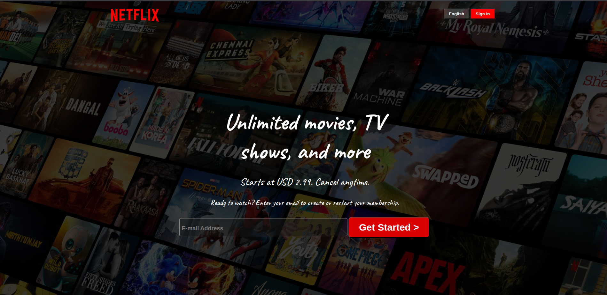

# Netflix Clone

A simple Netflix landing page clone built using only HTML and CSS. This project was created as a practice exercise to improve my frontend web development skills, particularly in HTML structure, CSS styling, layouts, and responsive design.

## 🚀 Features

- Responsive layout
- Hero section with background image
- Navigation bar
- FAQ section
- Clean and organized code structure
- Pure HTML and CSS (No JavaScript)

## 🛠️ Technologies Used

- HTML5
- CSS3

## 🎯 Purpose of the Project

The primary goal of this project was to:

- Practice HTML semantic structure
- Improve CSS styling skills
- Learn Flexbox and layout techniques
- Build a real-world UI clone
- Understand responsive web design principles

## 📸 Preview



> Add a screenshot of your project and save it as `preview.png` in the project folder.

## 📂 Project Structure

```
Netflix-Clone/
│
├── index.html
├── style.css
├── images/
├── favicon.ico
└── README.md
```

## 🌐 Live Demo

Add your deployed project link here:

```
https://shiplusaha995.github.io/Netflix-Clone/
```

## 📚 What I Learned

Through this project, I gained hands-on experience with:

- HTML page structure
- CSS positioning and layouts
- Flexbox
- Responsive design techniques
- UI cloning and recreation
- Project organization


## 👨‍💻 Author

**Shiplu Saha**

- CSE Student, Green University of Bangladesh
- Aspiring AI Engineer
- Interested in Web Development, AI, and Machine Learning

## ⭐ Acknowledgements

This project is inspired by Netflix and was created solely for educational and learning purposes. All trademarks and design elements belong to Netflix.